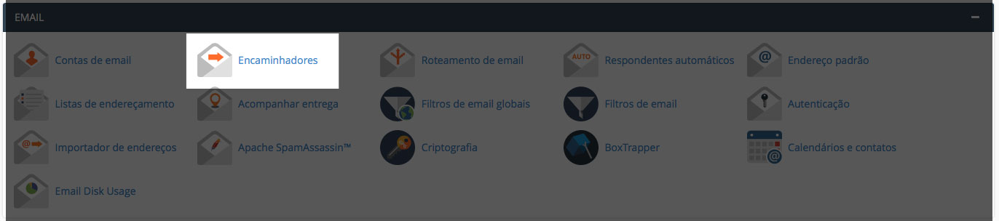
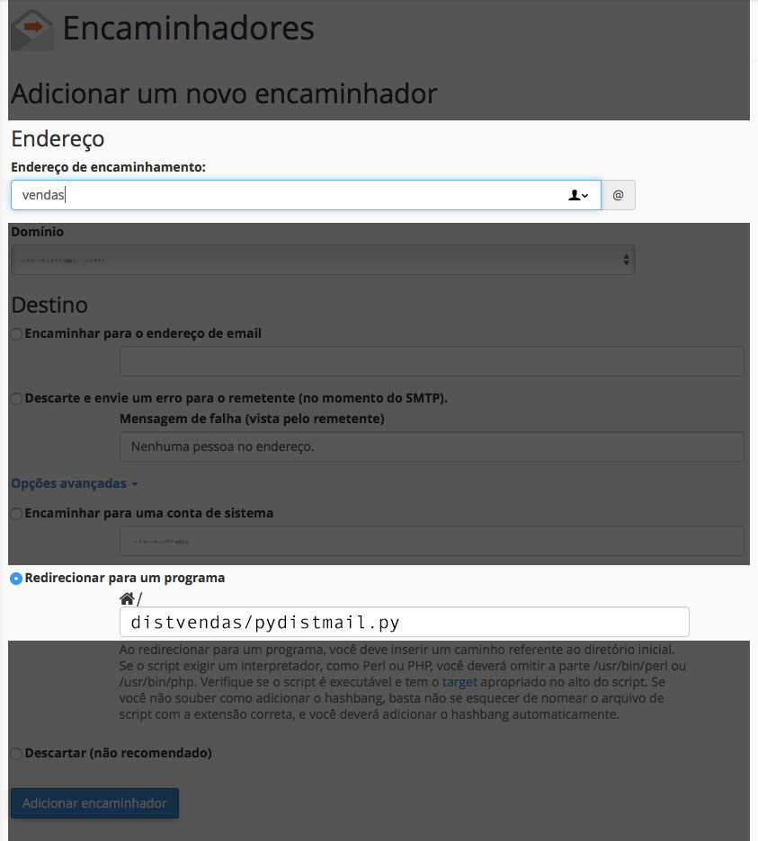

# Contact 'Leads' Distribution
Distributes the contacts you receive sequentially to emails in a list.

Use case
--------
When you have a sales team and would like the contacts received on a form
to be equally distributed between them.

How to Use in cPanel
--------------------

1. Create an email account that will receive the contacts ```Ex: sellers@domain.com```
2. Create the email accounts where the contacts will be distributed.
3. Upload the script to the server. (note: DO NOT use a public folder)
4. Change script privileges `$chmod 744 contact-distribution.py`
5. Change the list of sellers (the same as you created in step 2)

```python
# list with sellers or emails for distribution
sellers = [('Seller 01', 'seller01@domain.com'),
           ('Seller 02', 'seller02@domain.com'),
           ('Seller 03', 'seller03@domain.com')]
```

6. Change the primary receiving email. (the same one you created in step 1)

```python
s.sendmail("sellers@domain.com", sellers[nextSeller][1],
           msg.as_string())
```

7. Add a new forwarding to the mail distribution.



8. Forward it to the script.




Done.
