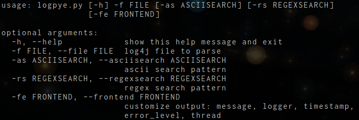

# script-logpye

## usage

* -h/--help			: displays help in picture above
* -f/--file			: points to log file(is required)
* -as/--asciisearch	: ascii text search, searches for a string in the log element
* -rs/--regexsearch	: regex search, input valid regex to search for in log element
* -fe/--frontend    : edit frontend printing this has to be valid python for now

###example

``python logpye.py -f core.log -as joystick``

``python logpye.py -f core.log -rx "\bjoystick\b.*?\botn-inst01\b"``

``python logpye.py -f core.log -as fathom -fe "error_level, logger, message, timestamp, thread"``
